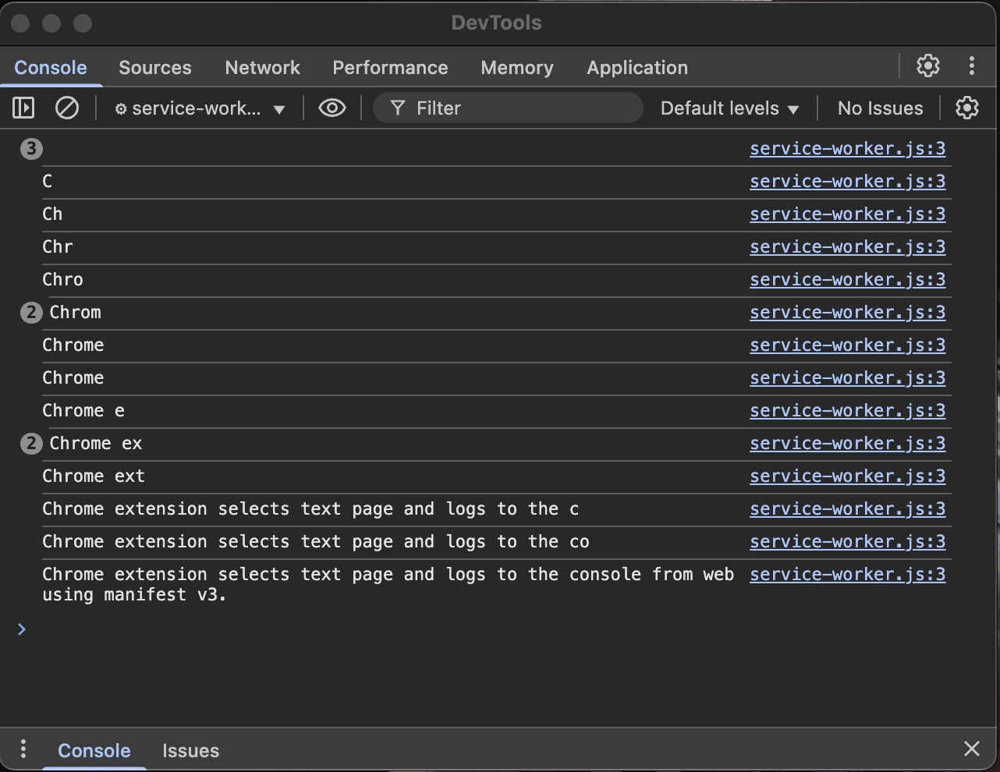

# Description

Chrome extension that copies selected text and logs to console. A simple example to resolve 'How to fix 'Unchecked runtime.lastError: Could not establish connection. Receiving end does not exist.' [stackoverflow](https://stackoverflow.com/questions/54619817/how-to-fix-unchecked-runtime-lasterror-could-not-establish-connection-receivi)

## Features

-   Content Script: Interacting with the webpage.
-   Service Worker: Managing background tasks and inter-component communication.

## Example

